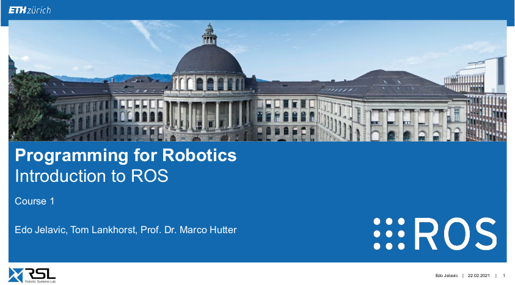
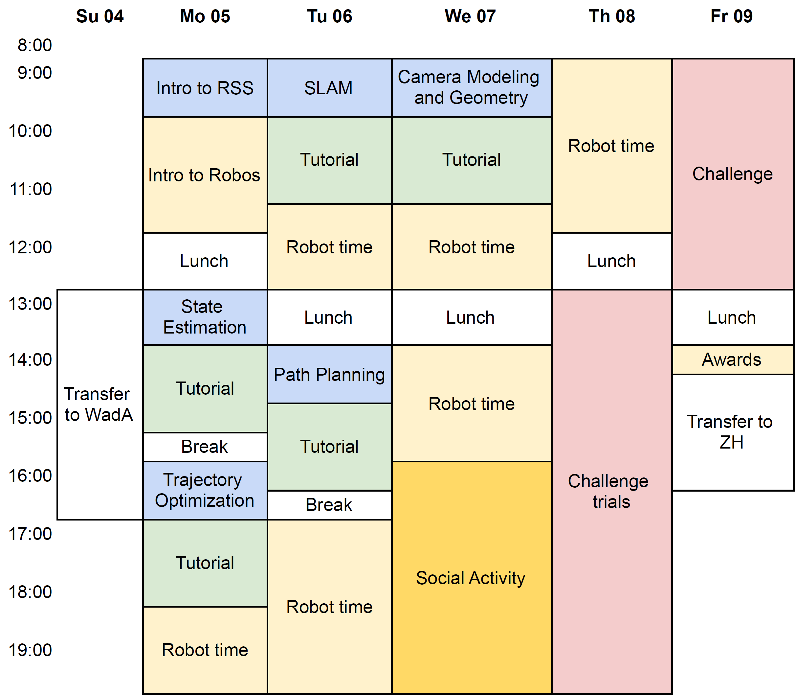

# ETH-ROS
<a href="https://robotics-summerschool.ethz.ch/"></a>

Robot Operating System exercises from ETH Zürich.

### Overview
This course gave an introduction to the Robot Operating System (ROS) including many of the available tools that are commonly used in robotics. With the help of different examples, the course provided a good starting point to work with robots. I learn how to create software including simulation, to interface sensors and actuators, and to integrate control algorithms.

<a href="https://robotics-summerschool.ethz.ch/"></a>

### First Exercise
Write a launch file using smb simulation with a different world: include ​smb_gazebo.launch​.
Change the ​ world_file ​argument to a world from the directory ​ /usr/share/gazebo-11/worlds (​ e.g.
worlds/robocup14_spl_field.world). ​
### Second Exercise 
In this exercise, you will create your first ROS package. The package should be able to
subscribe to a laser scan message from the SMB robot and process the incoming data.
### Third Exercise 
In this exercise, you will create your first ROS package. The package should be able to
subscribe to a laser scan message from the SMB robot and process the incoming data.
### Fourth Exercise 
-
### Fifth Exercise 
-

### Details
More details (preparation instructions, lecture slides, video recordings) on the course page: [Programming for Robotics - ROS](https://rsl.ethz.ch/education-students/lectures/ros.html)

## Preparing the notebook

### Install catkin tools from source instead of using apt
from this link: 
- https://catkin-tools.readthedocs.io/en/latest/installing.html#installing-from-source
Also useful:
- https://ethz-robotx.github.io/SuperMegaBot/core-software/installation_core.html 

### Catking Build Commands 

```
source /opt/ros/noetic/setup.bash

mkdir -p ~/catkin_ws/src
cd ~/catkin_ws
catkin init
```

build using this
```
catkin config -G"Eclipse CDT4 - Unix Makefiles"
catkin config --extend /opt/ros/noetic
catkin config -DCMAKE_BUILD_TYPE=Release
catkin config -DCMAKE_CXX_COMPILER_ARG1=-std=c++11
catkin config -D__cplusplus=201103L
catkin config -D__GXX_EXPERIMENTAL_CXX0X__=1

catkin buid 
```

or (this worked for me)

```

catkin build -G"Eclipse CDT4 - Unix Makefiles"
```

then
```
source devel/setup.bash
echo "source ~/catkin_ws/devel/setup.bash" >> ~/.bashrc
```

### External package to download 
```
use sudo apt install ros-noetic-package_name
```
package_name :
* velodyne-description
* hector-gazebo
* teleop-twist-keyboard
* pointcloud-to-laserscan
* ...


### Simlink external repo
Within your workspace/src link a repo inside .git folder
```
ln -s ~/.git/your_package
```
Then you have to build the workspace and source again the devel/setup.bash .
You can check the link using 
```
ls -o
```

### Eclipse setup for advance editing and compiling ROS scripts

Setup a Eclipse Workspace:
```
catkin build -G"Eclipse CDT4 - Unix Makefiles"
```
after that you may do:
- File > Import > General > Existing Project > "Select your workspace"
- Right Click on the project folder > Index > Rebuild

The project src is in the [Source directory].

Useful shortcuts:
* Ctrl + Space         : Autocomplete
* Ctrl + Shift + F     : Autoformat
* Ctrl + /             : Comment/Uncomment
* Ctrl + D             : Delete Line
* Ctrl + arrow up/down : Move fast up/down


